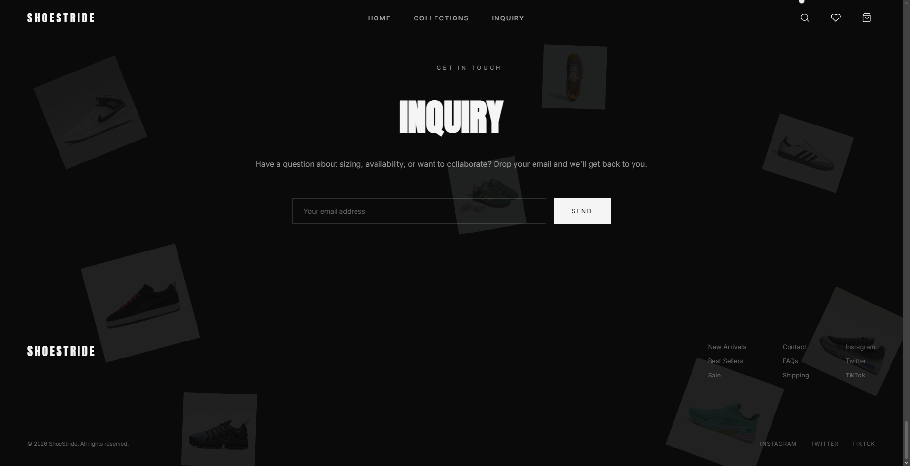
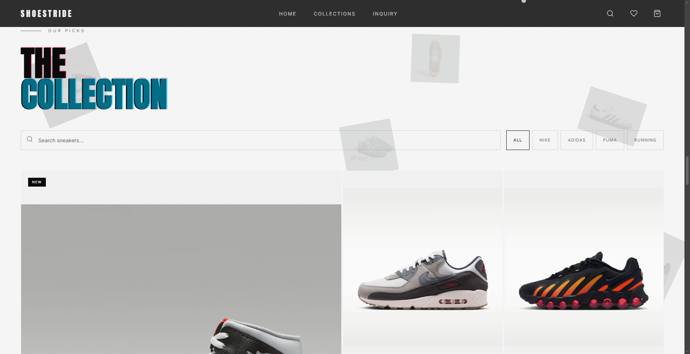
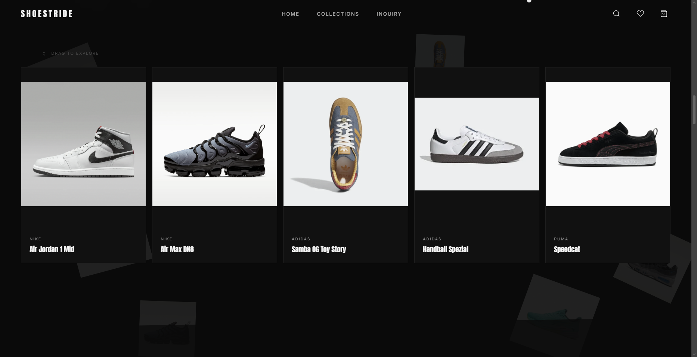
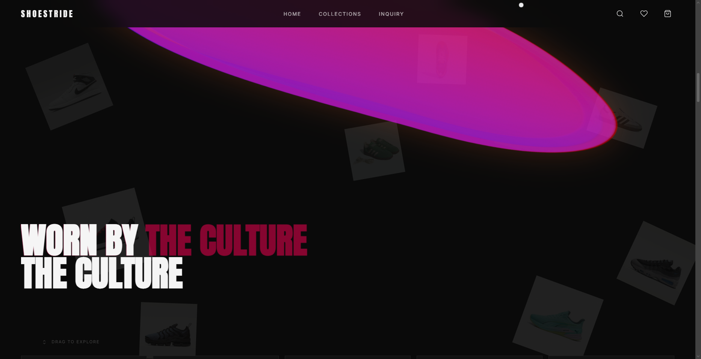
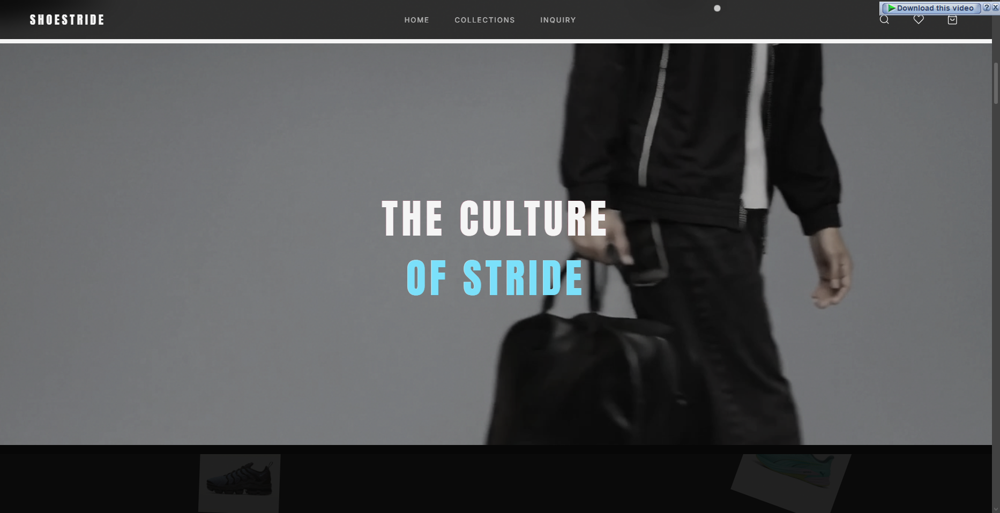
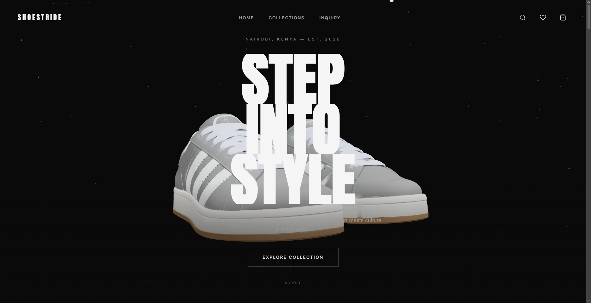

# ShoeStride 👟

**Premium Trending Sneakers for the Bold Generation**

> *Comfort meets culture in every stride.*

---

## 🌍 About ShoeStride

ShoeStride is a modern, interactive e-commerce platform showcasing premium sneakers from leading brands. Built in Nairobi, Kenya and established in 2026, we bring cutting-edge design and premium footwear to the bold generation.

Our platform features:
- 🎨 **Interactive 3D Models** - Explore shoes in stunning detail
- ⚡ **Smooth Animations** - Fluid scroll animations and transitions
- 📱 **Fully Responsive** - Beautiful on all devices
- 🛒 **Product Discovery** - Filter and search through premium collections
- 🎬 **Video Storytelling** - Immersive brand narrative
- 🎪 **Modern UI/UX** - Contemporary design with artistic flair

---

## 🎬 Website Screenshots

### Inquiry


### Featured Collections


### Grid


### Interactive Carousel


### Culture


### Home


---

## 🏗️ Tech Stack

- **Frontend:** JavaScript (46.5%)
- **Styling:** CSS (33%)
- **Markup:** HTML (20.5%)

### Key Libraries & Technologies

- **Three.js** - 3D rendering engine for interactive shoe models
- **Swiper** - Touch-enabled carousel and gallery
- **GSAP** - Advanced animation library with ScrollTrigger
- **Lenis** - Smooth scrolling experience
- **GLTFLoader** - 3D model loading and rendering
- **Google Fonts** - Anton, Bebas Neue, Inter typefaces

---

## ✨ Key Features

### 1. **Interactive 3D Hero Section**
- Animated 3D shoe model rendered with Three.js
- Scroll-triggered canvas animations
- Gradient overlays and split typography animations
- Custom cursor effects on dark backgrounds

### 2. **Smart Product Grid**
- Artistic product layout with responsive grid
- Real-time search functionality by product name
- Multi-brand filtering (Nike, Adidas, Puma, Running)
- Combined search and filter capabilities

### 3. **Dynamic Carousels**
- Swiper-powered trending products carousel with drag-to-explore
- Gallery with acrylic-style conveyor belt effect
- Smooth touch and mouse interactions
- Responsive to all screen sizes

### 4. **Visual Transitions**
- SVG wave animations between dark and light sections
- Morphing blob effects with chromatic aberration
- Animated gradient color shifts
- Smooth section transitions with GSAP

### 5. **Engagement Features**
- Custom cursor dot and label tracking
- Email inquiry form with validation
- Animated preloader with progress bar
- Mobile-responsive hamburger menu
- Smooth anchor link navigation

---

## 🗂️ File Structure

```
Shoe-Stride/
├── index.html              # Main HTML structure
├── styles.css              # Complete styling system (25KB)
├── app.js                  # Core JavaScript functionality (36KB)
├── shoe-model.glb          # 3D shoe model asset (480KB)
├── campus.glb              # 3D campus environment (48MB)
├── images/                 # Product image assets
│   ├── nike-*.webp         # 12 Nike sneaker images
│   ├── adidas-*.webp       # 16 Adidas sneaker images
│   ├── puma-*.webp         # 9 Puma sneaker images
│   └── puma-speedcat.mp4   # Video content (13MB)
├── screenshots/            # Website screenshots for documentation
├── tools/                  # Development tools directory
└── README.md               # Project documentation
```

---

## 🎯 Page Sections

1. **Header & Navigation** - Fixed header with logo, nav links, and icons (search, wishlist, cart, menu)
2. **Hero Section** - 3D model showcase with animated "STEP INTO STYLE" typography and scroll indicator
3. **Discount Marquee** - Promotional messaging carousel section with light background
4. **Video Section** - Full-width video player with "THE CULTURE OF STRIDE" text overlay
5. **Trending Carousel** - Interactive product showcase titled "WORN BY THE CULTURE"
6. **Gallery Section** - Visual product gallery with "THE GALLERY" heading
7. **Product Grid** - Comprehensive collection with search and filters titled "THE COLLECTION"
8. **Inquiry Form** - Email contact section with "Get in Touch" message
9. **Footer** - Navigation links, brand info, and social media connections

---

## 🚀 Getting Started

1. **Clone the repository**
   ```bash
   git clone https://github.com/John-Nyabwari/Shoe-Stride.git
   cd Shoe-Stride
   ```

2. **Open in your browser**
   ```bash
   # Direct file open
   open index.html
   
   # Or use a local server
   python -m http.server 8000
   # or
   npx http-server
   ```

3. **Visit the website**
   - Direct: Open `index.html` in your browser
   - Local Server: `http://localhost:8000`

---

## 💡 Design Highlights

- **Dark & Light Theme Transitions** - Strategic use of background colors for visual hierarchy and engagement
- **Typography** - Professional font stack with Anton (bold headings), Bebas Neue (branding), and Inter (body text)
- **Chromatic Text Effects** - Dynamic color-shifting text elements with RGB aberration filters
- **Acrylic & Glass Morphism** - Modern design aesthetic with blur and transparency effects
- **Smooth Scroll Behavior** - Enhanced user experience with Lenis smooth scrolling library
- **Responsive Design** - Mobile-first approach with breakpoints for all device sizes
- **Performance Optimized** - WebP image format, optimized 3D models, and efficient animations

---

## 🎬 Interactive Elements

### Product Carousel
- Swiper-powered carousel with intuitive drag interaction
- Visual "Drag to explore" hint on load
- Touch-friendly on mobile devices
- Smooth momentum scrolling

### Search & Filter System
- Real-time search by product name
- Brand filtering with active states
- Running category filter option
- Combined filter and search capabilities
- Visual feedback on active filters

### 3D Interactions
- Three.js powered 3D shoe visualization
- GLB model loading and rendering
- Scroll-triggered model animations
- Interactive camera movements

### Animations & Effects
- Split text animations with stagger timing
- Blob morphing transitions between sections
- Canvas-based particle effects in hero
- Scroll-triggered GSAP timelines
- Noise overlay for visual texture

---

## 📧 Contact & Inquiry

Have questions about sizing, availability, or want to collaborate? Use the inquiry form to get in touch. We'll respond promptly to your email.

**Email Inquiry Form Features:**
- Email validation
- Success/error messaging
- Accessible form design
- Mobile-friendly layout

---

## 🔗 Quick Navigation

- [Browse Collection](#collections) - Explore our trending sneakers
- [New Arrivals](#collections) - Latest shoes added to inventory
- [Get in Touch](#inquiry) - Contact and collaboration inquiries
- [Social Media](#footer) - Follow us on Instagram, Twitter, TikTok

---

## 📱 Browser Support

- Chrome/Edge 90+
- Firefox 88+
- Safari 14+
- Mobile browsers (iOS Safari, Chrome Mobile)

---

## 📄 License

© 2026 ShoeStride. All rights reserved.

---

## 🙌 Credits

**Built with passion in Nairobi, Kenya** | Est. 2026

*Premium sneakers. Bold generation. Every stride counts.*

**Technologies & Frameworks:**
- Three.js for 3D rendering
- Swiper for touch interactions
- GSAP for animations
- Lenis for smooth scrolling

---

## 🎯 Future Enhancements

- User authentication and accounts
- Shopping cart and checkout system
- Product reviews and ratings
- Wishlist functionality
- Size guide and fit recommendations
- Augmented Reality (AR) shoe try-on
- Order tracking system
- Customer support chat

---

**Step Into Style** 👟✨

Visit the live site and explore our premium sneaker collection today!
