# ShoeStride 👟

**Premium Trending Sneakers for the Bold Generation**

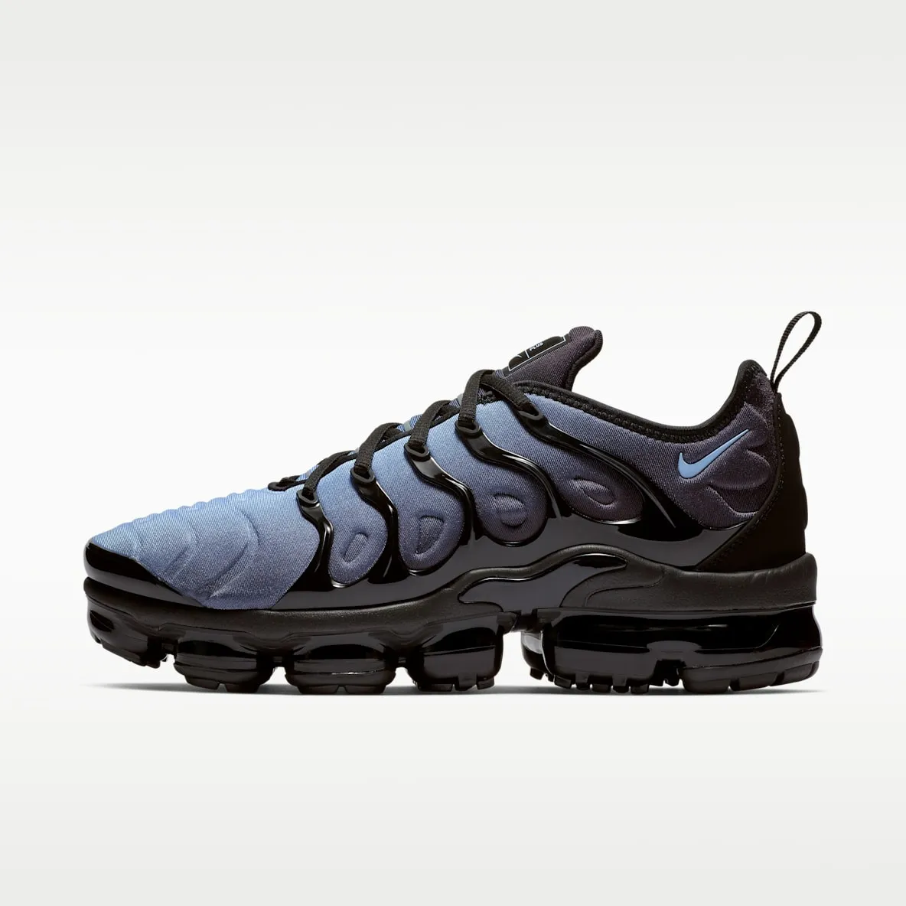

> *Comfort meets culture in every stride.*

---

## 🌍 About ShoeStride

ShoeStride is a modern, interactive e-commerce platform showcasing premium sneakers from leading brands. Built in Nairobi, Kenya and established in 2026, we bring cutting-edge design and premium footwear to the bold generation.

Our platform features:
- 🎨 **Interactive 3D Models** - Explore shoes in stunning detail
- ⚡ **Smooth Animations** - Fluid scroll animations and transitions
- 📱 **Fully Responsive** - Beautiful on all devices
- 🛒 **Product Discovery** - Filter and search through premium collections
- 🎬 **Video Storytelling** - Immersive brand narrative
- 🎪 **Modern UI/UX** - Contemporary design with artistic flair

---

## 🏗️ Tech Stack

- **Frontend:** JavaScript (46.5%)
- **Styling:** CSS (33%)
- **Markup:** HTML (20.5%)

### Key Libraries & Technologies

- **Three.js** - 3D rendering engine
- **Swiper** - Touch-enabled carousel
- **GSAP** - Animation library
- **Lenis** - Smooth scrolling
- **GLTFLoader** - 3D model loading

---

## 📦 Featured Collections

### Nike Collection
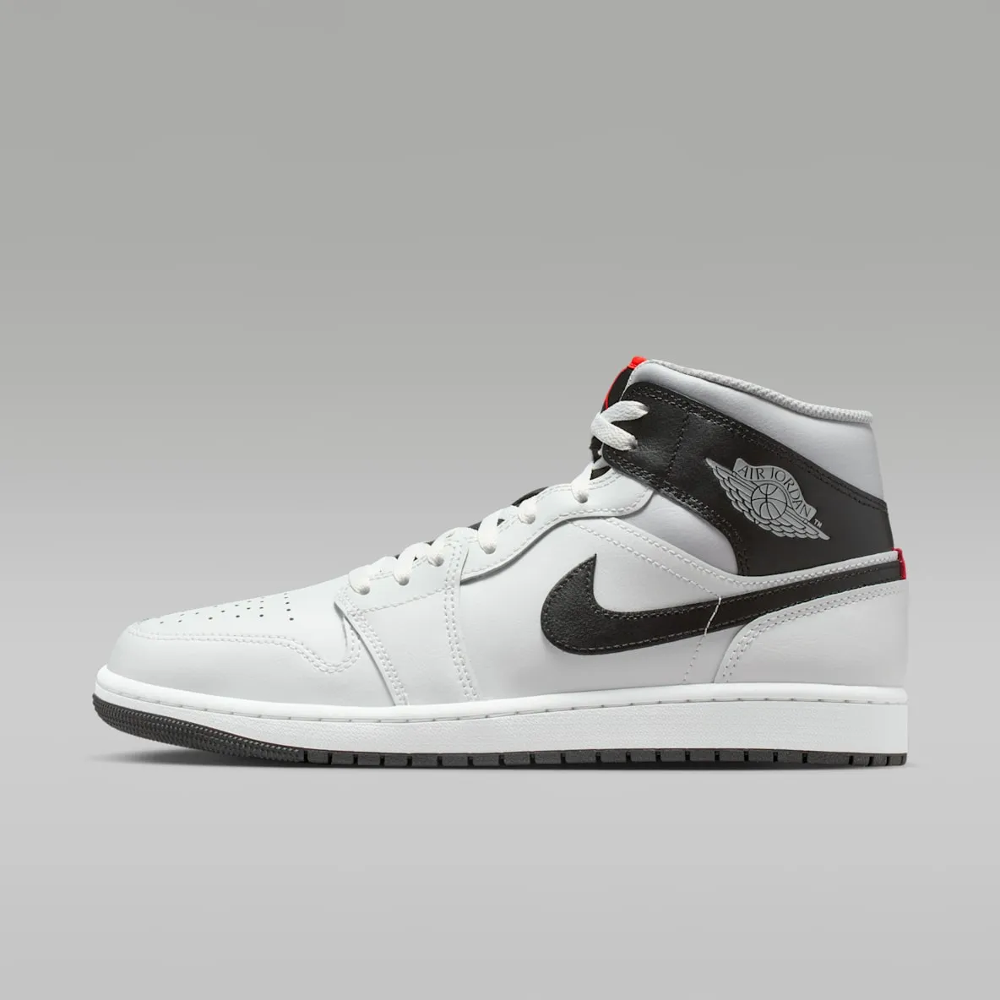
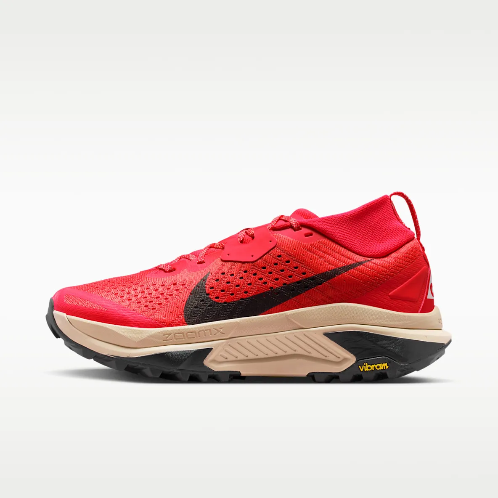
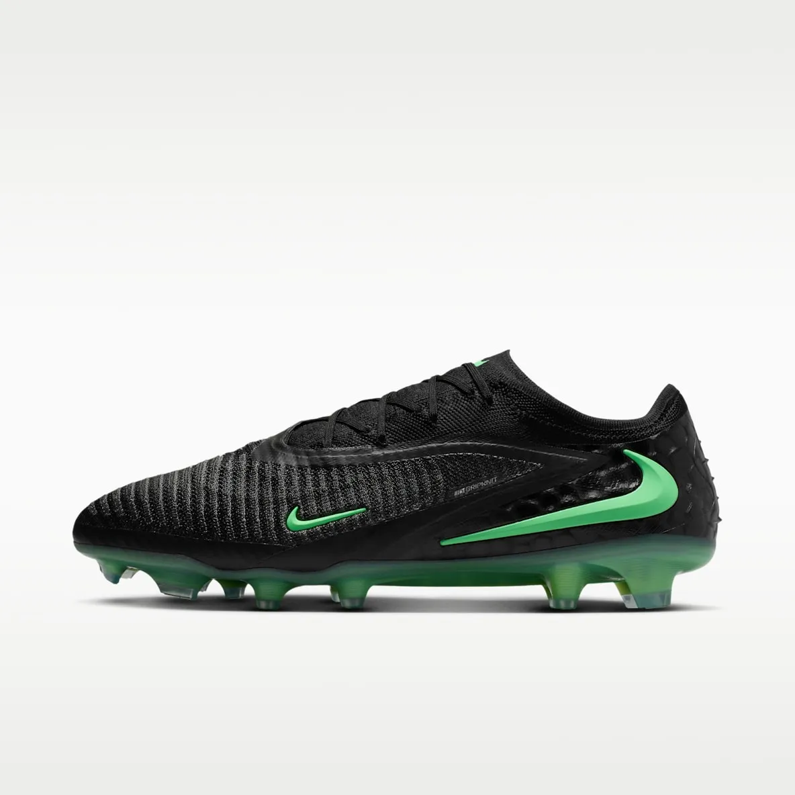

### Adidas Collection
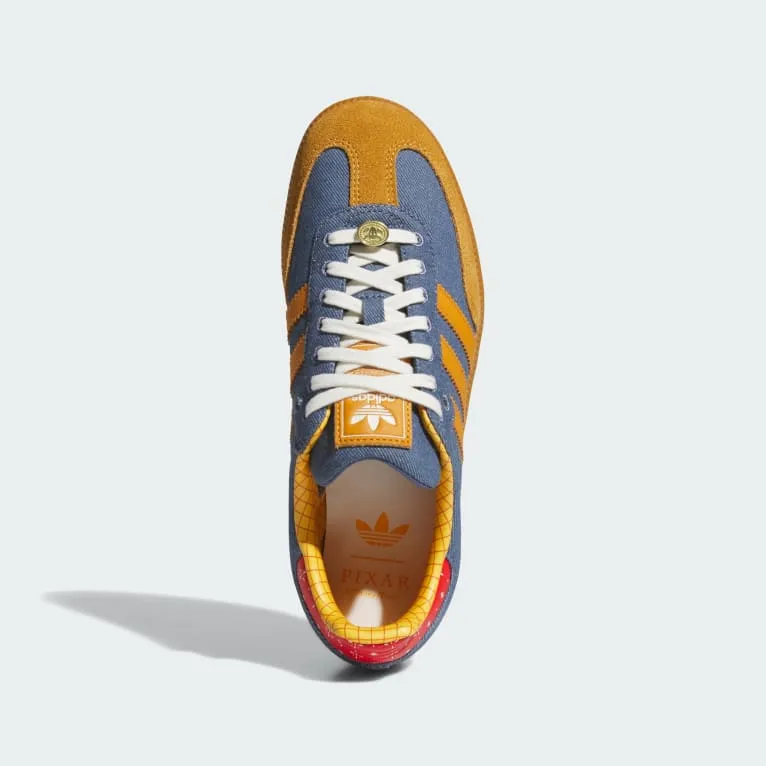
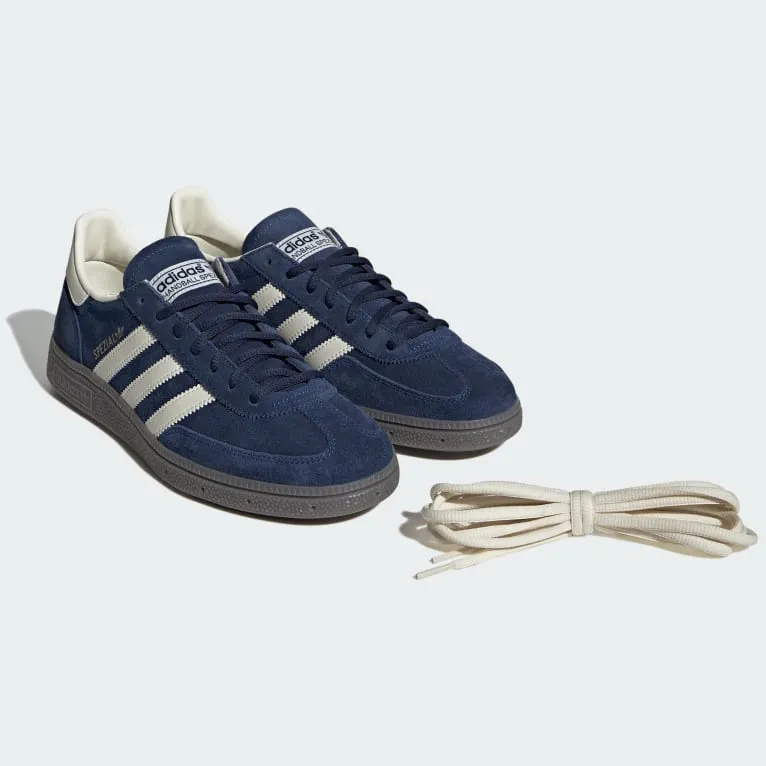
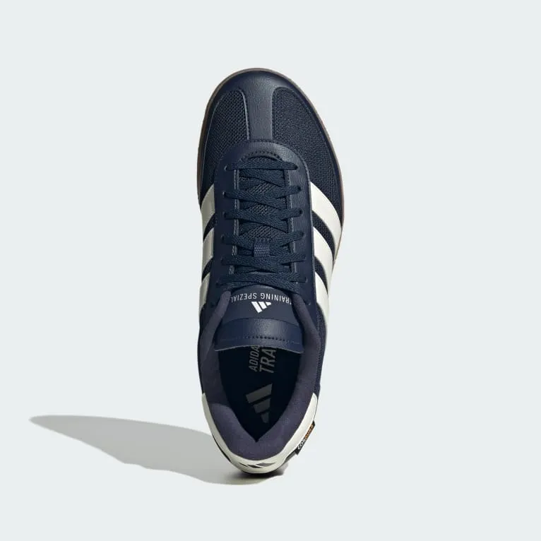

### Puma Collection
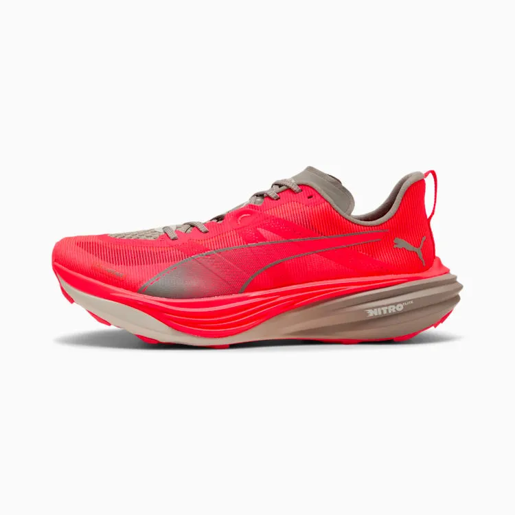
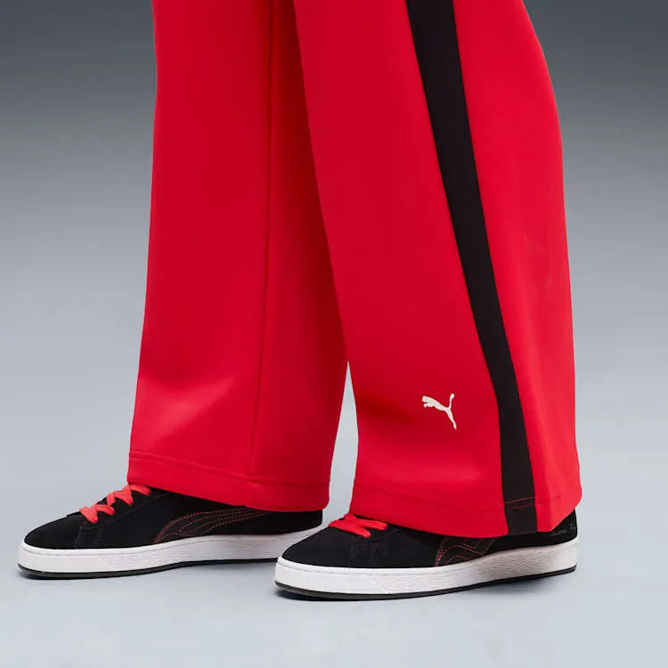
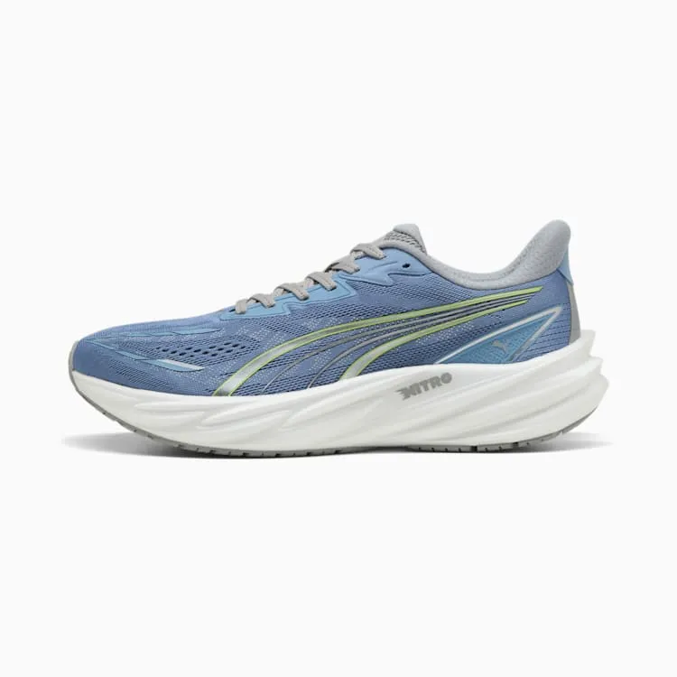

---

## ✨ Key Features

### 1. **Interactive 3D Hero Section**
- Animated 3D shoe model on scroll
- Canvas-based visual effects
- Gradient overlays and typography animations

### 2. **Smart Product Grid**
- Artistic product layout
- Real-time search functionality
- Filter by brand: Nike, Adidas, Puma, and Running category
- Responsive grid system

### 3. **Dynamic Carousels**
- Drag-to-explore product carousel
- Gallery with acrylic-style conveyor effect
- Smooth swiping experience

### 4. **Visual Transitions**
- SVG wave animations between sections
- Morphing blob effects
- Chromatic aberration filters
- Smooth color transitions

### 5. **Engagement Features**
- Custom cursor interactions
- Email inquiry form
- Preloader with progress bar
- Mobile-responsive menu

---

## 🗂️ File Structure

```
Shoe-Stride/
├── index.html              # Main HTML structure
├── styles.css              # Complete styling system
├── app.js                  # Core JavaScript functionality
├── shoe-model.glb          # 3D shoe model
├── campus.glb              # 3D campus environment
├── images/                 # Product image assets
│   ├── nike-*.webp         # Nike sneaker images
│   ├── adidas-*.webp       # Adidas sneaker images
│   ├── puma-*.webp         # Puma sneaker images
│   └── puma-speedcat.mp4   # Video content
└── tools/                  # Development tools
```

---

## 🎯 Page Sections

1. **Header & Navigation** - Fixed navigation with smooth scrolling
2. **Hero Section** - 3D model showcase with animated typography
3. **Discount Marquee** - Promotional messaging carousel
4. **Video Section** - Full-width video with text overlay ("THE CULTURE OF STRIDE")
5. **Trending Carousel** - Interactive product showcase ("WORN BY THE CULTURE")
6. **Gallery Section** - Visual product gallery
7. **Product Grid** - Comprehensive collection with filters ("THE COLLECTION")
8. **Inquiry Form** - Email contact section
9. **Footer** - Navigation links and social media

---

## 🚀 Getting Started

1. Clone the repository
   ```bash
   git clone https://github.com/John-Nyabwari/Shoe-Stride.git
   cd Shoe-Stride
   ```

2. Open in your browser
   ```bash
   open index.html
   # or use a local server
   python -m http.server 8000
   ```

3. Visit `http://localhost:8000` in your browser

---

## 💡 Design Highlights

- **Dark & Light Theme Transitions** - Strategic use of background colors for visual hierarchy
- **Typography** - Professional font stack with Anton, Bebas Neue, and Inter fonts
- **Chromatic Text Effects** - Dynamic color shifting text elements
- **Acrylic & Glass Morphism** - Modern design aesthetic
- **Smooth Scroll Behavior** - Enhanced user experience with Lenis

---

## 🎬 Interactive Elements

### Product Carousel
Swiper-powered carousel with drag interaction and smooth scrolling hints

### Search & Filter
- Real-time search by sneaker name
- Brand filtering (Nike, Adidas, Puma, Running)
- Combined search and filter capabilities

### 3D Interactions
- Three.js powered 3D shoe visualization
- GLB model loading and rendering
- Scroll-triggered animations

### Animations
- Split text animations
- Blob morphing transitions
- Canvas-based particle effects
- Scroll-triggered GSAP timelines

---

## 📧 Contact & Inquiry

Have questions about sizing, availability, or want to collaborate? Use the inquiry form to get in touch. We'll respond promptly to your email.

---

## 🔗 Quick Links

- **Browse Collection** - Explore our trending sneakers
- **New Arrivals** - Latest shoes added to inventory
- **Sale Section** - Special discounts and offers
- **Social Media** - Instagram, Twitter, TikTok

---

## 📄 License

© 2026 ShoeStride. All rights reserved.

---

## 🙌 Credits

Built with passion in **Nairobi, Kenya** | Est. 2026

Premium sneakers. Bold generation. Every stride counts.

---

## 🖼️ Gallery Preview

| Nike | Adidas | Puma |
|------|--------|------|
| 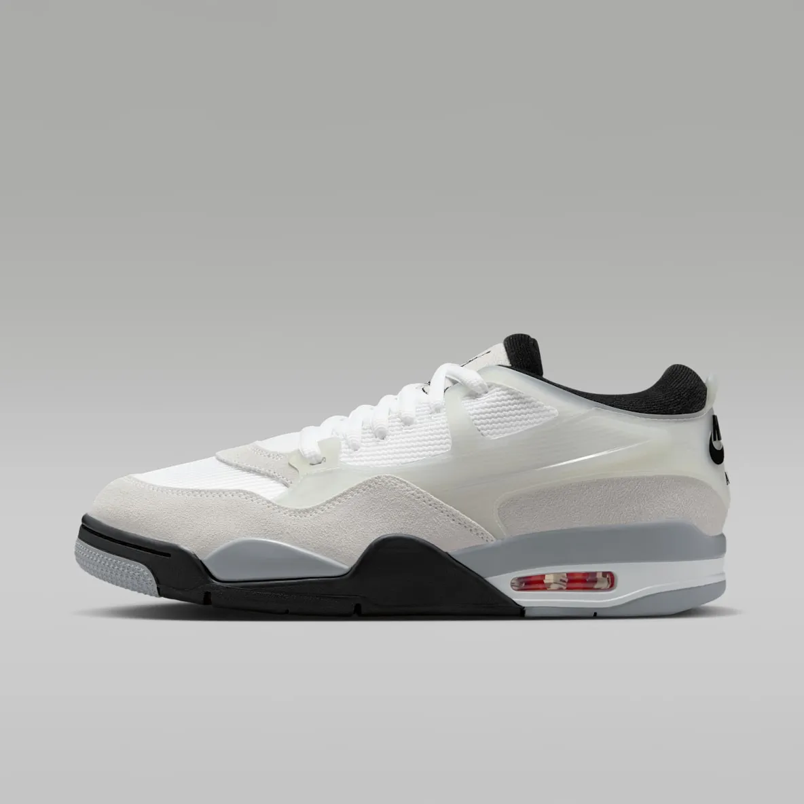 | 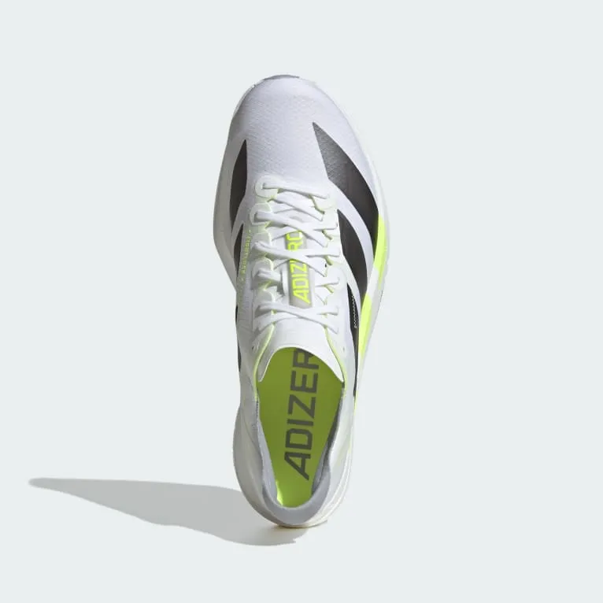 | 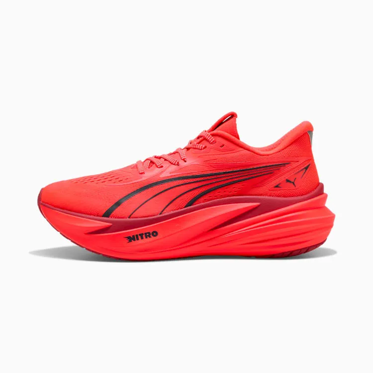 |
| 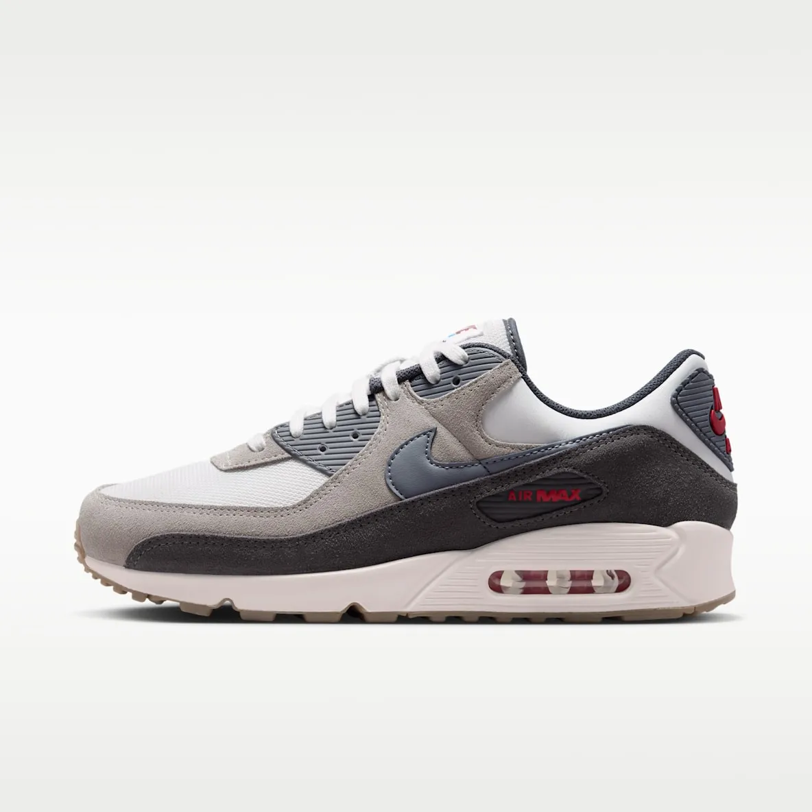 | 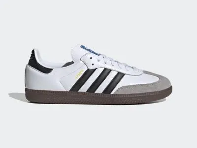 | 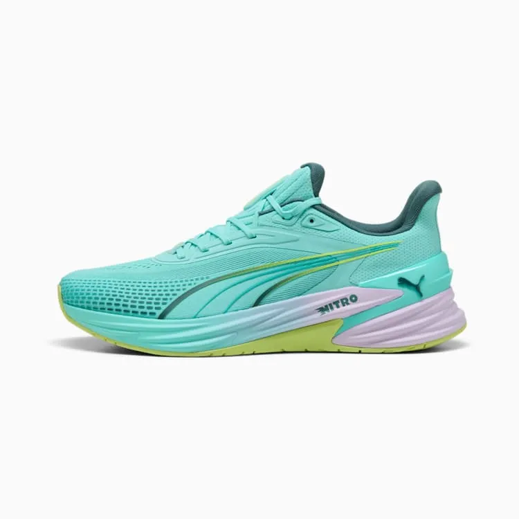 |
| 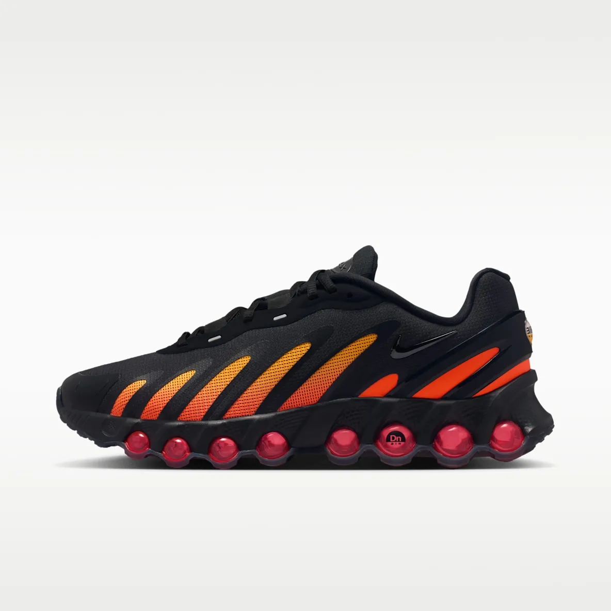 | 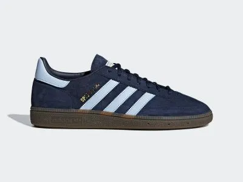 |  |

---

**Step Into Style** 👟✨
